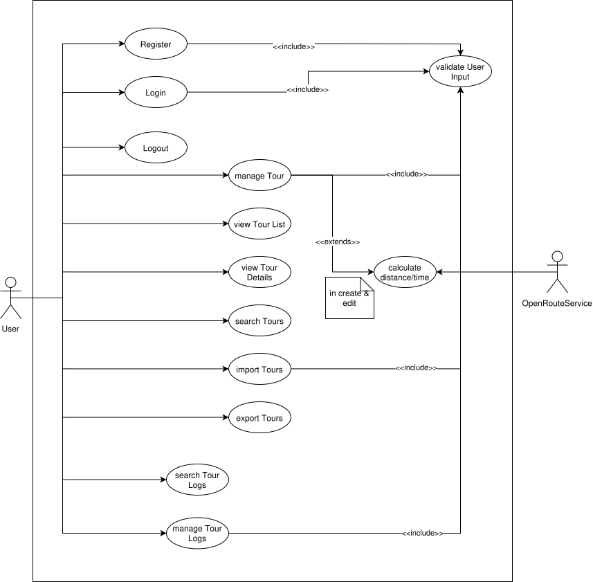

# Project Protocol – Tour Management Application
## 1. Technical Steps & Decisions
### 1.1 Architecture

The application is built using Angular & follows a Facade-based architecture.

 TourFacade is used to:
- Manage application state
- Handle business logic
- Provide data to UI components

This ensures a clear separation between:
- Presentation layer (components)
- Business logic (facade/services)

```
Components (View)
     │
     ▼
Mediators (ViewModel)
     │
     ├──▶ *Service / *Api (Model / Data Access)
     └──▶ Facades (Infrastructure abstraction)
```


### 1.2 Design Decisions
#### Facade Pattern

The frontend follows a layered architecture that mirrors the MVVM (Model–View–ViewModel) pattern Angular is designed around.

The TourFacade acts as an abstraction layer between components & services.

Each layer has a single, clearly defined responsibility. Components handle only rendering and user interaction. Mediators coordinate state and business logic. Services handle HTTP communication. Facades abstract third-party libraries.

#### Benefits:
- Simplifies component logic
- Centralizes state management
- Improves testability

#### Angular Signals & Forms

The application uses:
- signal() for state
- form() API for forms

#### Benefits:
- Reactive updates without manual subscriptions
- Reduced boilerplate
- Cleaner data flow
- Standalone Components

All components are implemented as standalone components.

#### Reasons:

- No need for NgModules
- Easier reuse & testing
- Cleaner project structure

### 1.3 Challenges & Failures

Starting with the initial implementation was tricky as we wanted make sure not that many changes have to be introduced after the backend is fully functional. This took a lot of time and continues to be a challenge.

Also getting used to frontend development was a bit more challenging as anticipated.

Hence --> Fucking centering a god damn div & the bubbles & getting them to be the same size
localStorage


## 2. Application Features



### Main features:

- User registration
- User login
- View tours
- Search tours
- View tour details
- Create tour
- Edit tour
- CRUD tour logs
- map visualization

#### Tour List

The tour list displays all tours belonging to the authenticated user as a scrollable card list. Each card shows the tour name, route (from → to), transport type, estimated distance and time, popularity and child-friendliness. Selecting a card sets the active tour in `TourFacade` and triggers route display in `MapFacade` to display the tour details.

#### Tour Creation and Editing

Tours are created and edited via a form component. Currently some of the fields are like to and from are not in their final form as the connection to ORS needs to be added as of now. The comlete From is then sent to the Facade to handle further processing.

#### Map View

The map is rendered using Leaflet with OpenStreetMap tiles. From and to markers are rendered on a dedicated marker layer group, drawn above the route polyline layer. When a tour is selected, the map fits its bounds to the route automatically.

#### Tour Log List

Tour logs are displayed in the context of a selected tour. Each log shows the date, comment, difficulty, total distance, total time, and rating. Logs are managed via CRUD operations in `TourFacade`. The initial view is condensed and only shows rating, difficulty and the timestamp of the comment.

#### Full-Text Search

Search is implemented as a Signal/Observable Interop in `TourFacade`. The searchable string for each tour includes name, description, from, to, transport type, all log comments, popularity count, and the child-friendliness. This means searching a transport type returns correct results without any backend involvement.

#### Login/Registration

Similar to the tour and tour log forms the user authentication forms are also utilizing signal forms. Using the validation functionality as well.

---

## 3. Wireframes
 
 

## 4. Application Architecture


#### Overview

The architecture consists of:

#### Components

- TourList
- TourDetails
- TourForm
- LogList
- LogForm
- LogListItem
- Login / Register
- MapFacade
- TourFacade
- LogFacade
- Services
- TourService (data handling)
- TourLogService (data handling)
- MapService (route calculation)

### Full-Text Search Flow

#### Process description:
1. User enters search query
2. Component calls setQuery() that sets the signal
3. Facade forwards data request to api service that returns an observable
4. Filtered tours turned into signal again
5. triggers UI updates automatically

## 6. Time Tracking

| Task | Time |
| ------ | ------ |
| general .css   | 5h   |
| user mock service   | 3h   |
| leaflet integration   | 2h |
| restructuring html   | 1h   |
| architecture   | 6h |
| mock services   | 3h   |
| mediators/facades| 4h|
| initial components| 5h |

Total: 29 hours

## 7. Git History

[https://github.com/Z1rael/tour-planner-app](https://github.com/Z1rael/tour-planner-app)

## 8. Summary

The project demonstrates:
- A clean separation of concerns using the Facade pattern
- Reactive programming with Angular Signals
- Modular & maintainable component structure
- A foundation for future extensions
- mock services can be replaced by real services by the time the backend is ready without a lot extra effort
